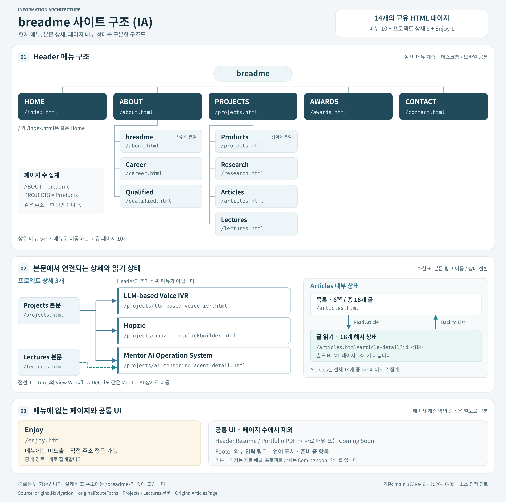

# 사이트 구조(IA) 및 페이지 명세

이 문서는 **사이트 구조(IA) → 페이지별 목적·동작 → 콘텐츠 편집 원본** 순서로 읽는다. 먼저 방문자가 보는 메뉴와 실제 페이지의 연결을 확인하고, 아래 명세에서 주소·CTA 상태·수정 파일을 찾는다.

## 한눈에 보는 현재 사이트 구조(IA)



[큰 PNG로 보기](images/site-ia.png) · [편집 원본 SVG](images/site-ia.svg)

그림은 Header·라우트와 상세 페이지 연결을 나타낸다. 2026-10-08 학력·업무 원칙 재배치는 기존 메뉴·URL·페이지 수를 유지하므로 SVG/PNG의 계층은 바뀌지 않는다. 세 페이지 내부의 최신 섹션 순서는 아래 별도 명세를 따른다. 메뉴·라우트가 바뀌면 SVG와 PNG를 함께 갱신하고 텍스트 구조·페이지 명세도 대조한다. SVG는 편집 원본, PNG는 글꼴/앱 환경에 관계없이 읽기 위한 표시본이다.

### Header 메뉴: 방문자가 보는 탐색 구조

아래는 현재 Header의 메뉴 이름과 순서다. ABOUT와 PROJECTS는 상위 메뉴 자체에도 연결 주소가 있으며, 각각 첫 하위 항목과 같은 페이지를 연다. 데스크톱/모바일은 같은 메뉴 정보를 사용한다.

```text
breadme
├─ HOME → Home /index.html (루트 /와 동일)
├─ ABOUT → About /about.html
│  ├─ breadme → About /about.html (상위 메뉴와 같은 페이지)
│  ├─ Career → /career.html
│  └─ Qualified → /qualified.html
├─ PROJECTS → Projects /projects.html
│  ├─ Products → Projects /projects.html (상위 메뉴와 같은 페이지)
│  ├─ Research → /research.html
│  ├─ Articles → /articles.html
│  └─ Lectures → /lectures.html
├─ AWARDS → /awards.html
└─ CONTACT → /contact.html
```

### 본문에서 연결되는 상세와 메뉴에 없는 페이지

다음 항목은 Header의 추가 하위 메뉴가 아니다. 각 본문 링크로 들어가는 상세, Articles 안의 읽기 상태, 직접 주소로만 노출되는 페이지를 구분한다.

```text
Projects 본문
├─ LLM-based Voice IVR → /projects/llm-based-voice-ivr.html
├─ Hopzie → /projects/hopzie-oneclickbuilder.html
└─ Mentor AI → /projects/ai-mentoring-agent-detail.html
   └─ Lectures 본문의 View Workflow Detail에서도 같은 상세로 연결

Articles 본문
└─ 영어 글 18개 → /articles.html#article-detail?id=<ID>
   └─ 목록 6쪽의 읽기/복귀 상태이며, 별도 HTML 페이지 18개가 아님

Header 메뉴 미노출
└─ Enjoy → /enjoy.html (직접 주소 접근 가능, 비공개 페이지가 아님)
```

- **페이지 수:** Header에서 가는 고유 페이지 10개 + 프로젝트 상세 3개 + Enjoy 1개 = 14개. 같은 페이지를 여는 상위/하위 메뉴, Articles 읽기 상태는 중복 집계하지 않는다.
- **별도 행동:** Header의 Resume/Portfolio PDF는 메뉴 페이지가 아니라 자료 패널 또는 Coming Soon 안내를 여는 조작이다. Footer의 외부 연락 링크·언어/준비 중 항목도 [공통 진입과 미완성 CTA](#2-공통-진입과-미완성-cta)에서 별도로 명세한다.
- **읽는 순서:** [14개 페이지 명세](#1-현재-라우트-총-14개) → [공통 CTA 상태](#2-공통-진입과-미완성-cta) → [편집 원본](#4-무엇을-어디서-고치는가). 구조가 바뀌면 실제 메뉴/라우트 설정과 이 그림을 같은 PR에서 갱신한다.

### Home·Qualifications·About의 본문 IA (2026-10-08)

| 페이지 | 현재 읽기 순서와 상세 진입 |
| --- | --- |
| Home | Hero → 파트너 → 발자취 → 경력 → 학력 요약(`#history-2`) → 하단 제품 CTA. 요약에는 M.S. in Human-AI Interaction / Sungkyunkwan University, B.A. in Psychology / Sookmyung Women's University와 `qualified.html` 링크를 둔다. |
| Qualifications (`qualified.html`) | Hero → 전체 Academic Standing(`#history-2`) → Core Competencies 6개 → 기존 인증. 전체 학력의 사진·기간·내용·View publications·Google Scholar 링크는 이전 Home에서 그대로 이동한다. |
| About (`about.html`) | 소개·이름 도식 → 업무 원칙(`#how-work`) → Media(`#media`). 네 원칙 카드의 문구·태그·사진·순서를 이전 Qualifications에서 그대로 이동한다. |

Qualifications의 기존 인증 내용·필터와 여섯 역량 카드는 보존한다. Career, Header의 Qualified 이름과 모든 메뉴 URL도 바꾸지 않는다. Home의 `#history-2`는 요약 앵커로 유지하고 Qualifications의 같은 ID는 별도 문서의 전체 학력 앵커다. Home의 학력 링크는 `/breadme/qualified.html` 페이지 맨 위로 연결한다(2026-10-09). 명시적인 `/breadme/qualified.html#history-2` 직접 링크는 그대로 유지한다. 이전 `qualified.html#how-work` 직접 링크는 `OriginalPage.tsx`에서 `about.html#how-work`로 replace 이동한다. 기존 콘텐츠 이동의 화면 비교는 [IA QA 기록](../qa/education-principles-ia.md)에 보존한다. Home 링크의 페이지 상단 도착·반복 탐색과 직접 학력 앵커 유지는 [상단 이동 QA](../qa/home-education-top-link.md)에서 별도로 확인한다.

## 기준

- 최초 메뉴/라우트 문서 기준: `main` [`3738e46`](https://github.com/nana-park/breadme/tree/3738e4620bb495ecfcd7ef589c91c2049ce0153a), 2026-10-05. Home·About·Qualifications의 본문 위치는 2026-10-08 작업 브랜치의 승인된 IA에 맞춰 갱신했다. 시작 기준 커밋은 `58a617a3bb60261f750a2cf9fb46979e81decd82`이며, 실행 결과는 [해당 QA 기록](../qa/education-principles-ia.md)에 별도로 남긴다. 문서 갱신은 main 병합·배포나 새 브라우저 검수 완료를 뜻하지 않는다.
- 제품 목적·사용자 가설·성공 기준은 [제품 개요](overview.md)에 둔다. 여기서는 실제 주소, 진입, CTA 상태와 편집 원본을 기록한다.
- 아래 `/…`는 앱 기준 경로다. 배포 설정의 base는 `/breadme/`이므로 실제 예시는 `/breadme/projects.html`이다. `/`와 `/index.html`은 같은 Home이며 2개 화면으로 세지 않는다.
- 주소와 HTML 빌드의 단일 원본은 [`originalRoutes.ts`](../../src/config/originalRoutes.ts), 화면 매핑은 [`OriginalPage.tsx`](../../src/pages/original/OriginalPage.tsx), 활성 메뉴는 [`content/original/navigation.ts`](../../src/content/original/navigation.ts)다.

## 1. 현재 라우트: 총 14개

“공개 경로”는 인증 없이 접근하도록 빌드되는 경로라는 뜻이다. 해당 내용의 사실 확인·저작권 승인·실제 배포 검수가 완료되었다는 뜻은 아니다.

| # | 경로 / 페이지 | 진입·노출 | 주요 내용과 현재 동작 | 본문 원본 |
| --- | --- | --- | --- | --- |
| 1 | `/index.html` / Home | HOME·로고·루트 | 텍스트 Hero → 파트너·발자취 → 흰색 경력 요약 → 학위·학교 2개 요약(`#history-2`) → Product Focus / Core Strengths CTA. 학력 상세 → `qualified.html`. 경력의 `Products` → Projects, `Full career` → Career. `View my work`·`View products` → Projects, `Get in touch` → Contact. 기존 캐러셀·경력 내용 유지 | [HomeHero](../../src/pages/home/HomeHero.tsx), [HomeExperience](../../src/pages/home/HomeExperience.tsx), [OriginalHomeContent](../../src/pages/original/generated/OriginalHomeContent.tsx) |
| 2 | `/about.html` / About (`breadme`) | ABOUT와 하위 breadme | 소개·브랜드 의미/이름 도식 → 기존 원칙 카드 4개(`#how-work`) → 미디어(`#media`). `View my projects` → Projects, `Watch full interview` → YouTube. 임베드 인터뷰 재생과 기존 원칙 내용·태그·사진 유지 | [OriginalAboutContent](../../src/pages/original/generated/OriginalAboutContent.tsx) |
| 3 | `/career.html` / Career | ABOUT 하위 Career | 경력 2패널·추천 카드. `View projects` → Projects; 추천 카드 가로 탐색. 이번 IA 변경에서 Career는 그대로이며 학력 상세는 Qualifications에서 제공 | [OriginalCareerContent](../../src/pages/original/generated/OriginalCareerContent.tsx) |
| 4 | `/qualified.html` / Qualifications | ABOUT 하위 Qualified·Home 학력 요약 | Hero → 전체 Academic Standing(`#history-2`) → 기존 Core Competencies 6개 → 4개 인증 탭(`AI & Tools`, `Data & Statistics`, `Psychology`, `Languages`). 학력 사진·기간·모든 세부 내용·View publications·Google Scholar 링크 보존. 기존 인증과 탭 전환 유지. 업무 원칙은 About으로 이동 | [OriginalQualifiedContent](../../src/pages/original/generated/OriginalQualifiedContent.tsx) |
| 5 | `/enjoy.html` / Enjoy | 주 메뉴 미노출, 직접 주소 가능 | 7개 취미/활동 카테고리와 여행 지역 선택. `All Destinations`는 전체 사진 순서를 섞는다. 선택 카테고리를 세션에 보관 | [OriginalEnjoyContent](../../src/pages/original/generated/OriginalEnjoyContent.tsx) |
| 6 | `/projects.html` / Projects (`Products`) | PROJECTS·하위 Products·Home/About/Contact | 제품군과 프로젝트, `View more/fewer projects`, `View/Hide projects`, 9개 `details` 펼침. 3개 사례 상세 링크, 논문·로컬 PDF·외부 Notion 링크. 목록 펼침은 검색/필터 기능이 아님 | [OriginalProjectsContent](../../src/pages/original/generated/OriginalProjectsContent.tsx) |
| 7 | `/research.html` / Research | PROJECTS 하위 Research·Qualifications 학력 | 연구 4건. `Read Paper`는 ScienceDirect·DOI·사이트 PDF, `Conference`는 외부 링크 | [OriginalResearchContent](../../src/pages/original/generated/OriginalResearchContent.tsx) |
| 8 | `/articles.html` / Articles | PROJECTS 하위 Articles | 영어 글 18개·6쪽·한 쪽 3개. `Read Article`로 해시 읽기, 위/아래 `Back to List`로 복귀, `View Original (KR)`로 ArtInsight 외부 원문 | [OriginalArticlesPage](../../src/pages/original/OriginalArticlesPage.tsx), [글 데이터](../../src/content/original/articles/index.ts) |
| 9 | `/lectures.html` / Lectures | PROJECTS 하위 Lectures | 2개 강의/멘토링 항목·각 사진 캐러셀. 이전/다음·표시점·키보드·터치 이동. `View Workflow Detail` → Mentor AI 상세 | [OriginalLecturesContent](../../src/pages/original/generated/OriginalLecturesContent.tsx) |
| 10 | `/awards.html` / Awards | AWARDS | 수상·후원 등 이미지와 반복 표시 콘텐츠. `Get in Touch with breadme` → Contact. 반복 마크업 수를 별도 수상 건수로 세지 않음 | [OriginalAwardsContent](../../src/pages/original/generated/OriginalAwardsContent.tsx) |
| 11 | `/contact.html` / Contact | CONTACT·Home/Awards | `Review Projects` → Projects, `View Profile` → LinkedIn. 본문 이메일 버튼은 핸들러 없음. Resume/PDF는 공통 Coming Soon 패널, Copy URL은 공개 홈 주소 복사·결과 alert. 자료 요청 폼은 비활성 | [OriginalContactContent](../../src/pages/original/generated/OriginalContactContent.tsx) |
| 12 | `/projects/llm-based-voice-ivr.html` / LLM-based Voice IVR | Projects 상세 링크 | 사례·5개 탭(`Conversational Routing`, `Separate Chatbot`, `Reuse Scenarios`, `Building`, `Demo Call`)·YouTube 데모·뉴스·기업 로고. `Back to Products` → Projects. 실제 통화/답변 저장 API 없음 | [OriginalVoiceIvrContent](../../src/pages/original/generated/OriginalVoiceIvrContent.tsx) |
| 13 | `/projects/hopzie-oneclickbuilder.html` / Hopzie | Projects 상세 링크 | 사례·5개 탭(`Storefront`, `Building`, `Commission Optimization`, `Link Resilience`, `YouTube Description`)·뉴스·크리에이터 링크. `Generate Commerce Page`는 로컬 오버레이 표시 전환, 예시 storefront 링크는 탭 전환. 실제 사이트 생성/발행 아님. `Back to Products` → Projects | [OriginalHopzieContent](../../src/pages/original/generated/OriginalHopzieContent.tsx) |
| 14 | `/projects/ai-mentoring-agent-detail.html` / Mentor AI Operation System | Projects·Lectures | 사례·5개 탭(`Learner Memory`, `Workflow Automation`, `Meeting Parsing`, `Insight Extraction`, `Memoirs`)·React 목업. Scheduled Automation은 설정 영역 표시 전환이며 실제 예약/실행 서비스 아님. `Back to Products` → Projects | [OriginalMentoringContent](../../src/pages/original/generated/OriginalMentoringContent.tsx), [목업](../../src/pages/original/generated/OriginalMentoringMockupContent.tsx) |

### 주소·노출에서 혼동하기 쉬운 점

- [정적 페이지 빌드](../../scripts/static-pages.ts)는 라우트 설정으로 14개 HTML 진입 파일을 만든다. 같은 앱 셸을 로드하므로 본문은 JavaScript가 필요하다. HTML 사전 렌더링/SSR이라고 설명하지 않는다.
- `resolveOriginalPage`는 경로의 마지막 파일명을 보고 화면을 고르고 알 수 없으면 Home을 반환한다. 이는 앱이 이미 로드된 경우의 동작이다. 배포 서버의 임의 잘못된 URL까지 Home으로 연결하는 404 규칙은 아니다.
- Enjoy의 메뉴 숨김은 접근 통제가 아니다. 빌드 대상에 남아 있으므로 비공개 사진 보관함으로 사용하지 않는다.
- 하위 프로젝트 상세는 3개뿐이다. 페이지 내부 데모나 9개 펼침 항목을 별도 라우트로 세지 않는다.
- [`src/config/navigation.ts`](../../src/config/navigation.ts)의 한국어 앵커 메뉴, [`HomePage.tsx`](../../src/pages/home/HomePage.tsx), 이전 Header/Footer는 초기 미리보기 구조다. 현재 App의 내비게이션 원본으로 수정하지 않는다.
- `OriginalArticlesContent.tsx`도 변환 산출물로 남아 있지만 실제 Articles는 `OriginalArticlesPage.tsx`를 렌더링한다.

## 2. 공통 진입과 미완성 CTA

| 위치 | 표시/진입 | 실제 처리 | 기획·QA 해석 |
| --- | --- | --- | --- |
| Header | HOME, ABOUT, PROJECTS, AWARDS, CONTACT와 하위 메뉴 | 기본 링크 이동; 1024px 미만 모바일 메뉴 | 메뉴의 이름/순서는 활성 navigation과 같이 수정 |
| Header, 기본 11페이지 | Resume / Portfolio PDF | 동일한 `Application Materials` 패널 열기 | 다운로드 버튼으로 완료 표시 금지 |
| Header, 상세 3페이지 | Resume / Portfolio PDF | `Coming soon!` alert, 자료 패널 미렌더링 | 기본 페이지와 진입 반응이 다름 |
| 공통 자료 패널 | 이메일 입력·Receive package | 입력·전송 모두 disabled, submit 차단, Coming Soon 표시 | 이메일 수집·자료 전송 없음. 설명의 “instantly receive”는 구현 보장이 아님 |
| 최소화 자료 바로가기 | 떠 있는 원형 버튼 | 기본 페이지에만 존재; 767px 이하에서는 페이지 전체에서 숨김 | 모바일에는 Header 메뉴 진입이 남음. Home Hero 이후 다시 보인다는 과거 설명은 현 CSS와 다름 |
| Contact 본문 | Resume / Portfolio PDF | native button으로 공통 Application Materials 패널 열기 | Coming Soon·비활성 폼 유지. 닫기/Escape 뒤 본문 진입 버튼으로 초점 복귀 |
| Contact 본문 | Copy URL | `https://nana-park.github.io/breadme/`를 Clipboard API로 복사. 실제 write 완료 뒤 “포트폴리오 웹사이트 URL이 복사되었습니다” alert | 거부·미지원은 별도 실패 alert와 직접 선택할 URL 제공. 현재 Contact 경로·query·hash를 복사하지 않음 |
| Contact 본문 | 이메일 표시 버튼 | 클릭/클립보드 핸들러 없음 | 패키지 직접 조작 수정의 범위 밖 |
| Contact 본문 | 자료 요청 폼 | 이름·이메일·회사 입력과 submit 모두 disabled | `data-original-submit`의 원본 성공 alert는 실행하지 않음 |
| Footer | Critic & Essay, Instagram, LinkedIn, Email | 외부 사이트 또는 `mailto:` 이동 | 외부 페이지 이용·메일 발송 결과는 사이트가 확인하지 않음 |
| Footer | Interviews / Seminars / Korean | 기본 이동 차단 또는 버튼 클릭 뒤 `Coming soon!` alert | 실제 콘텐츠·언어 전환 아님 |
| Footer | English | 활성 표시, 전환 핸들러 없음 | 현재 표시 언어는 영어 |
| 상세 내부 목업 | 전화, Save Answer, 실행/저장 버튼 등 | 사례 설명용 UI; 바인딩된 탭·데모 표시 상태 외 서비스 동작 없음 | 목업의 편집 가능한 브라우저 필드와 실제 저장/서버 처리를 구분 |

근거: [App](../../src/app/App.tsx), [Header](../../src/shared/layout/OriginalHeader/OriginalHeader.tsx), [Footer](../../src/shared/layout/OriginalFooter/OriginalFooter.tsx), [MaterialsPopup](../../src/shared/ui/MaterialsPopup/MaterialsPopup.tsx), [자료 패널 CSS](../../src/shared/ui/MaterialsPopup/MaterialsPopup.module.css), [페이지 동작](../../src/shared/hooks/useOriginalPageInteractions.ts), [상세 동작](../../src/shared/hooks/useOriginalDetailInteractions.ts). 2026-10-06 Contact 패키지 직접 조작은 [ContactPackageActions](../../src/pages/original/ContactPackageActions.tsx)에 연결했다. 다른 미완성 기능의 완료를 뜻하지 않는다.

## 3. Articles 콘텐츠 목록: 총 18개

현재 기준은 [index.ts](../../src/content/original/articles/index.ts)의 순서·ID·날짜·영어 제목이다. 각 글은 같은 폴더의 `Article<ID>Body.tsx`에 있고 원문 URL은 메타데이터의 `url`이다. 제목·날짜·요약은 이 문서에 중복하지 않고 해당 원본에서 수정한다. 아래 ID는 18개 연결 상태를 확인하는 목록이며, 표현의 품질이나 주장에 대한 재검증을 뜻하지 않는다.

- 목록: 1쪽 3개, 총 6쪽. 페이지 번호는 React 상태이며 URL에 기록하지 않는다.
- 읽기 주소: `/articles.html#article-detail?id=<ID>`; 예: `/articles.html#article-detail?id=66504`.
- 복귀: `#articles`로 돌아오며 같은 마운트 안에서 목록 페이지·스크롤·선택 링크 초점을 보존한다. 스크롤은 메모리와 `sessionStorage`를 사용하며 저장소 오류 시 메모리로 처리한다.
- 해시 직접 진입과 브라우저 Back/Forward를 처리한다. 알 수 없는 ID는 빈 상세 대신 목록을 보여 준다.
- `View Original (KR)`은 외부 ArtInsight 원문이다. 사이트 한국어 번역 기능과 별개다.

| 목록 쪽 | 기사 ID (표시 순서) |
| --- | --- |
| 1 | `66504`, `65617`, `65427` |
| 2 | `64006`, `63259`, `60586` |
| 3 | `58579`, `58119`, `56148` |
| 4 | `54710`, `54170`, `53074` |
| 5 | `52537`, `51061`, `50529` |
| 6 | `50044`, `50043`, `47268` |

본문/이미지/링크의 이관 일치성은 [콘텐츠 README](../../src/content/original/articles/README.md), [source-expectations.json](../../src/content/original/articles/source-expectations.json), [콘텐츠 테스트](../../src/content/original/articles/articles.test.tsx)에서 확인한다. 해시·복귀·목록 동작은 [화면 테스트](../../src/pages/original/OriginalArticlesPage.test.tsx), [E2E](../../tests/e2e/articles.spec.ts)가 담당한다. 테스트의 원문 일치와 사실·저작권 검증은 별개다.

## 4. 무엇을 어디서 고치는가

| 수정 대상 | 현재 활성 원본 | 함께 확인할 곳 |
| --- | --- | --- |
| Home 첫 소개/CTA 문구 | [homeHero.ts](../../src/content/site/homeHero.ts) | [HomeHero](../../src/pages/home/HomeHero.tsx), [Home README](../../src/pages/home/README.md) |
| Home 경력 요약 | [homeExperience.ts](../../src/content/site/homeExperience.ts) | [HomeExperience](../../src/pages/home/HomeExperience.tsx), [Home README](../../src/pages/home/README.md) |
| Home 학력 요약 | `OriginalHomeContent.tsx`에서 연결한 요약과 `qualified.html` 링크 | [Home README](../../src/pages/home/README.md), [IA QA 기록](../qa/education-principles-ia.md), [IA override](../../scripts/apply-education-ia-override.ts) |
| 전체 Academic Standing / 업무 원칙 | `OriginalQualifiedContent.tsx`의 학력 / `OriginalAboutContent.tsx`의 `#how-work` | [원본 페이지 README](../../src/pages/original/README.md), 이동한 본문·사진·링크와 원본의 동등성, 변환기 재생성 보존 |
| Home 로고/갤러리/CTA·About·Career·Qualified·Enjoy·Projects·Research·Lectures·Awards·Contact·상세 본문 | 위 라우트 표의 `generated/Original…Content.tsx` | 해당 CSS, 두 interaction hook, [원본 페이지 README](../../src/pages/original/README.md), [변환기](../../scripts/convert-original-pages.mjs) |
| Articles 제목·날짜·요약·원문 링크·순서 | [articles/index.ts](../../src/content/original/articles/index.ts) | 연결된 `Article<ID>Body.tsx`, source expectations와 검사 |
| Articles Hero·읽기/복귀 버튼 문구 | [pageContent.ts](../../src/content/original/articles/pageContent.ts) | [OriginalArticlesPage](../../src/pages/original/OriginalArticlesPage.tsx) |
| 본문 이미지·동영상·문서 | [원본 manifest](../../src/content/original/asset-manifest.json), [외부 manifest](../../src/content/original/external-asset-manifest.json), 각 사용처 | [assetUrl/originalHref](../../src/shared/utils/originalPaths.ts), [원본 에셋 문서](../original-assets.md), [외부 에셋 문서](../original-external-assets.md) |
| 메뉴 이름·주소 | [originalNavigation](../../src/content/original/navigation.ts), [originalRoutePaths](../../src/config/originalRoutes.ts) | Header, 정적 HTML 생성, 라우트 테스트, 이 문서 |
| 공통 자료·Footer 문구와 링크 | [MaterialsPopup](../../src/shared/ui/MaterialsPopup/MaterialsPopup.tsx), [OriginalFooter](../../src/shared/layout/OriginalFooter/OriginalFooter.tsx) | App의 페이지별 자료 진입 분기와 비활성 상태 |
| 공통 공식 명칭 | [shared-terms.md](../content/shared-terms.md), [terms.ts](../../src/content/shared/terms.ts) | 실제 사용처의 중복 표기. 기존 이관 JSX 전체가 이미 단일 원본으로 연결되었다고 가정하지 않음 |
| 브라우저 제목·메타 설명·언어 | [index.html](../../index.html), [App](../../src/app/App.tsx) | 현재 공통 제목/설명을 사용하는 상태. 페이지별 검색 메타데이터 구현을 가정하지 않음 |

### 변환 산출물 편집 주의

현재는 [콘텐츠 분리 규칙](../ground-rules/10-content-and-localization.md)의 목표 구조로 모든 페이지가 옮겨진 상태가 아니다. 많은 공개 본문은 `generated/` JSX에 그대로 있다. 존재하지 않는 `src/content/projects/` 또는 CMS에서 편집하라고 안내하지 않는다.

`generated/` 파일은 원본 HTML에서 변환한 산출물이다. [변환 manifest](../../src/pages/original/generated/conversion-manifest.json)는 원본 저장소/커밋/파일을 기록하며 변환기는 지정 원본 커밋을 검사한다. 수동 편집을 할 경우 다음 재생성에서 덮어쓰일 위험을 먼저 확인한다. 콘텐츠 변경 PR에서는 현재 원본, 변경을 보존할 방식, 변환기 영향과 테스트 기대값 갱신 이유를 적는다. 단순 콘텐츠 수정과 대규모 콘텐츠 모델 전환을 한 작업에 섞지 않는다.

## 5. 외부 의존과 데이터 처리 경계

| 구분 | 현재 확인한 사용 | 유지보수·기획상 주의 |
| --- | --- | --- |
| 정적 호스팅 | GitHub Pages `/breadme/`, 14개 HTML 진입 파일 | 정확한 배포 커밋은 `deployment.json`으로 확인. 호스팅 로그 정책은 이 소스 검토로 확정하지 않음 |
| 에셋 준비 | 고정 원본 커밋의 147개 파일, 외부 manifest의 211개 available 항목을 로컬 배포 경로로 준비 | manifest의 해시/파일 수는 출처·바이트 일치 정보이며 권리 허가나 최신 사실 검증이 아님 |
| 미디어 | About의 YouTube iframe/API, Voice IVR 상세의 YouTube iframe, 로컬 영상 | 방문 시 외부 미디어 요청이 생길 수 있음. iframe이 있다는 사실만으로 무추적·동의 적합성을 주장하지 않음. API 실패 시 About은 기본 iframe/원문 링크를 유지 |
| 외부 이미지 fallback | Hopzie의 지정 크리에이터 아바타 오류 시 `ui-avatars.com` 초기 문자 URL을 `assetUrl`로 해석 | available manifest에 있으면 로컬로 치환. 미등록 외부 URL은 원격으로 남을 수 있음. 모든 요청이 항상 로컬이라고 단정하지 않음 |
| 외부 자료·프로필 | 논문/DOI, ArtInsight, 뉴스·YouTube, Google Scholar, LinkedIn·Instagram, 외부 Notion/회의 링크 | 링크의 존재와 실제 열람 권한·현재 유효성은 다름. 대상 변경·개인정보 공개 범위를 확인하고 공개 문서에 연락처를 중복 복제하지 않음 |
| 메일 앱 | Footer의 `mailto:` 링크 | 사용자 메일 앱 진입이며 사이트의 메일 발송 API가 아님 |
| 세션 저장 | Articles: `articlesScrollY`에 스크롤 위치. Enjoy: `activeLifeTab`에 카테고리 ID | 서버 수집·프로필·분석 이벤트가 아님. 브라우저 세션 범위이며 저장 불가 시 fallback이 있음 |
| 목업 입력 | 상세의 데모 토글·선택·일부 입력은 브라우저 UI 상태 | 실제 통화, 커머스 배포, AI 호출, 예약 실행·저장 서비스로 설명하지 않음 |
| 자료 요청 입력 | 공통 패널/Contact 폼 disabled, submit 차단 | 현재 사용자 입력 수집·보관·전송 경로 없음. 기능 활성화 전에 별도 설계 필요 |
| 분석·인증·결제 | 검토한 활성 앱 코드에서 해당 서비스 연결 확인 안 됨 | 조회수·전환율·가입/결제 기능을 현재 구현으로 기록하지 않음. 외부 서비스의 데이터 처리까지 부재를 보장하는 문구 금지 |
| 남아 있는 Spline 코드 | 의존성·컴포넌트 파일은 존재하나 현재 Home Hero는 텍스트 컴포넌트 | 파일 존재만으로 활성 3D 화면/런타임 기능에 포함하지 않음 |

## 6. 콘텐츠 편집과 주장 검증 체크리스트

### 변경 전

- [ ] 현재 활성 컴포넌트와 콘텐츠 파일을 찾았다. 초기 미리보기·미사용 변환 파일을 잘못 편집하지 않는다.
- [ ] 변경 목적·대상 언어·페이지·CTA 도착지를 명시했다.
- [ ] 역할·기간·성과 수치·추천 문구·고객/기관/프로젝트 공식 명칭의 근거와 공개 가능 범위를 확인했다.
- [ ] 숫자는 정의·분모·기간·측정 조건·본인 기여와 팀 성과를 확인한다. 사이트에 이미 적힌 숫자를 새 검증 결과로 인용하지 않는다.
- [ ] 연구/수상/인증은 제목·날짜·상태·발행/수여 주체와 연결 자료를 대조한다. 로고/인용/초상·사진·문서의 공개 권한은 별도로 확인한다.
- [ ] [공통 명칭](../content/shared-terms.md)과 언어별 승인 상태를 확인했다. 번역되지 않은 명칭이나 강의의 깨진 문자를 추측으로 보정하지 않는다.
- [ ] 비공개 이력서·개인 연락처·내부 자료·자격 증명은 공개 Git 이력이나 근거 링크에 넣지 않는다. 필요한 경우 “별도 확인 필요”만 기록한다.

### 편집과 검증

- [ ] 설명·버튼이 실제 제공 기능과 일치한다. `Coming Soon`, 숨김, disabled, 동작 미연결, 로컬 목업을 각각 구분한다.
- [ ] `data-original-*` 문자열만 보고 동작 완료를 선언하지 않고, 이벤트 바인딩과 외부 전송 여부를 확인했다.
- [ ] URL slug/ID/원문 링크/이미지 경로가 연결된 콘텐츠와 맞고 모바일·데스크톱에서 접근 가능하다.
- [ ] generated 파일 수정의 재생성 보존 방식을 기록했다. Articles 기대값은 승인된 원문 변화가 있을 때만 근거와 함께 바꾼다.
- [ ] 바뀐 경로의 직접 진입·새로고침·CTA·복귀·키보드·모바일 상태와 링크/이미지를 확인했다. 실제 실행하지 않은 검사를 통과로 기록하지 않는다.
- [ ] 본문에 남은 과거 정보·중복 섹션·깨진 문자·외부 링크 접근 실패는 근거와 확인 범위를 기록했다. 원문 보존 검사가 콘텐츠 정확성 검사를 대신하지 않는다.

### 리뷰와 반영

- [ ] 의미·공식 명칭·성과·번역·개인정보·외부 공개 변경은 [콘텐츠 확인 규칙](../ground-rules/10-content-and-localization.md)에 따라 확인을 받았다.
- [ ] 페이지 목적/구조/콘텐츠 위치/핵심 흐름이 바뀌면 페이지 README와 이 문서를 갱신했다. 공통 컴포넌트 영향이 있으면 적용표도 확인했다.
- [ ] 검증 기록에는 커밋, 범위, 실행 결과와 남은 확인 항목을 분리했다.
- [ ] `main` 병합과 추가 공개의 승인을 콘텐츠 검토나 Draft PR 생성과 별개로 취급했다.

문서 갱신 책임과 결정 기록 방식은 [문서 유지보수](../maintenance.md), 남은 항목의 우선순위는 [백로그](../backlog.md)에서 관리한다.

권장하는 주장 검토 기록 형식은 `페이지/항목 → 현재 문구 → 주장 유형 → 공개 가능한 근거 → 검토 상태 → 결정/일자`다. 이 형식은 새 데이터베이스나 승인 시스템이 이미 구현되어 있다는 뜻이 아니며, 민감한 근거 원문 대신 공개 가능한 최소한의 확인 결과만 저장한다.
