# 모바일 전체 UI 검수: As-is / To-be

[← 프로젝트 README](../../README.md) · [TC·재현 절차](mobile-ui-test-cases.md) · [Draft PR #3](https://github.com/nana-park/breadme/pull/3)

작은 글자, 말줄임, 그림 왜곡, 화면 밖 링크와 떠 있는 버튼의 가림을 수정했습니다. **아래 오른쪽 화면은 검토용 후보이며 공개 사이트는 main `4f026a3`입니다.** Resume/Portfolio PDF의 Coming Soon 상태는 유지합니다.

## 먼저 볼 것

- 모바일: **14개 경로·18개 글**을 검사했습니다. 대표 문제 11개를 아래에 전후 화면으로 정리했습니다.
- 웹: 새 디자인을 적용하지 않고 **768/1440px의 기존 첫 화면·Footer를 보존하는지** 별도 비교했습니다.
- 변경 화면의 기준은 구현 커밋 [`44027e9`](https://github.com/nana-park/breadme/commit/44027e9b88be7c9e9f3d6bfa45f047ac5e5958d5)입니다. 이후 `93af4a5`·`ac0644`는 테스트만 바뀌었으며 앱 코드는 같습니다.
- AI Mentoring 상세의 선택적 글자 역할 표식 2개는 미적용입니다. 제목 32px·설명 14px가 유지됩니다. 공통 메뉴·Footer와 해당 경로 검사는 포함했습니다.
- 기록한 실행에는 **미해결 검증 항목이 있습니다. 전체 CI 합격이나 모든 데스크톱 픽셀 동일을 선언하지 않습니다.** 정확한 구분은 아래 [실행 기록](#실행-기록)을 참고하세요. 문서 작성 뒤의 최신 커밋 결과는 [PR 검사](https://github.com/nana-park/breadme/pull/3/checks)에 표시됩니다.

## 읽는 방법과 범위

각 비교 그림은 **왼쪽 As-is / 오른쪽 To-be**입니다. 그림을 누르면 원본 크기로 볼 수 있습니다. 같은 경로·폭·논리 상태를 비교합니다. 레이아웃 변화로 스크롤 위치와 보이는 세로 범위는 다를 수 있으며, 부분 캡처는 따로 표시합니다.

- As-is: 기본적으로 UI 변경 전 `193d767` 또는 읽기 상태 캡처 `25019f4`입니다. 두 버전의 UI는 main `4f026a3`과 같습니다. 6번 Projects 비교만 첫 수정 후보 `19176d9`에서 추가 발견한 문제를 보여 줍니다.
- To-be: 앱 수정 `44027e9`, 모바일 전용 108개 검사가 통과한 실행의 PNG입니다.
- GitHub Actions Chromium에서 캡처했습니다. 실제 휴대폰, iOS Safari, 스크린리더의 종합 검수가 아닙니다.
- 320·360·375·390·430·767·768px에서 경로/글자 경계를 확인하고 1440px를 함께 비교했습니다. 18개 글은 모두 390px, 대표 긴 글·제목에는 추가 폭과 확대 상태를 적용했습니다. 모든 글을 모든 폭에서 검사했다는 뜻은 아닙니다.
- 200% 예시는 실제 계산 글자 크기·줄간격을 2배로 만드는 **합성 글자 확대**입니다. 루트 글꼴 확대는 별도 검사하며, 둘 다 브라우저 자체 확대와 다릅니다.

## 1. Lectures: 첫 화면의 글자 위계와 상세 말줄임

- 경로·폭·상태: `/lectures.html`, **390px**, 첫 화면
- 재현: 페이지를 열고 첫 강의의 제목·Overview·Audience·Focus 등을 읽습니다.
- As-is: 작은 소개와 메타 정보, 상세 값의 말줄임 때문에 내용을 끝까지 읽기 어렵습니다.
- To-be: 제목과 소개의 크기·줄간격을 정리하고 상세 값의 줄바꿈을 허용했습니다. 길어진 내용은 자연스럽게 아래로 이어집니다.
- TC: **L09 / F01 / F05 / I02**. 캡처 비교와 강의 필수 문구 12개의 범위·줄바꿈 검사가 통과했습니다. 아래 그림은 첫 화면이며 전체 12개 값은 스크롤 상태 검사에 포함됩니다.

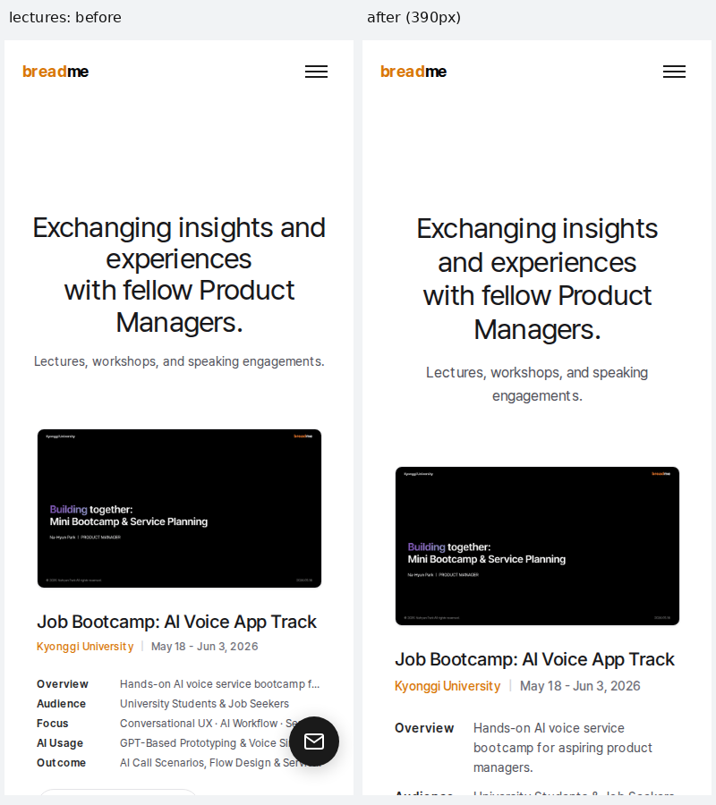

## 2. Awards: 그림의 어두운 부분 위에 놓인 제목

- 경로·폭·상태: `/awards.html`, **390px**, 첫 화면
- 재현: 페이지를 열고 검은 제목이 배경 그림과 겹치는지 봅니다.
- As-is: 검은 금속·그림자와 제목이 겹쳐 읽기 어렵습니다.
- To-be: 원본 그림을 보존하고 제목을 별도의 읽기 줄로 옮겼습니다. 모바일 그림 상자의 높이와 잘리는 구도는 달라집니다.
- TC: **L10 / F08**. 320/390px PNG와 제목 범위 검사가 통과했습니다.

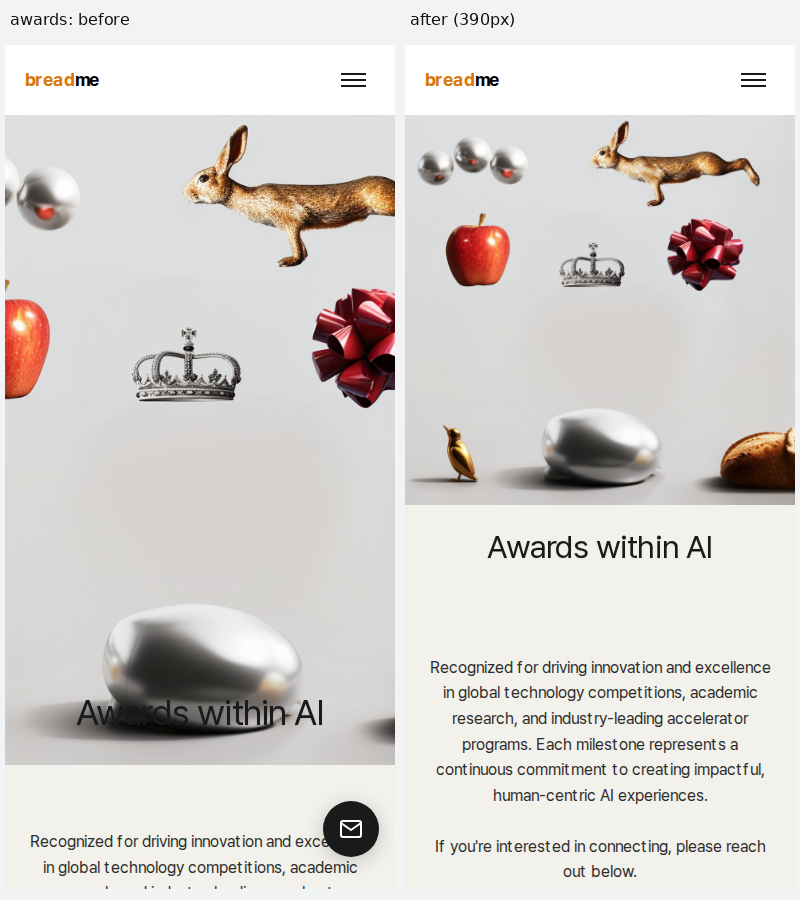

## 3. About: 이름 유래 도식의 잘린 BREAD

- 경로·폭·상태: `/about.html`, **390px**, 이름 유래 도식 **부분 캡처**
- 재현: 이름 유래 설명까지 내려가 왼쪽 BREAD를 읽습니다.
- As-is: BREAD의 왼쪽이 화면 밖으로 밀려 B가 잘립니다.
- To-be: 도식의 세 열이 좁은 화면 안에 들어오도록 조정했습니다. 두 부분 캡처의 세로 길이는 다르지만 가로 390px 축척은 같습니다.
- TC: **L02 / F06**. 320/390/767px 도식 검수 및 실제 BREAD/ME 글자 범위 검사가 통과했습니다.

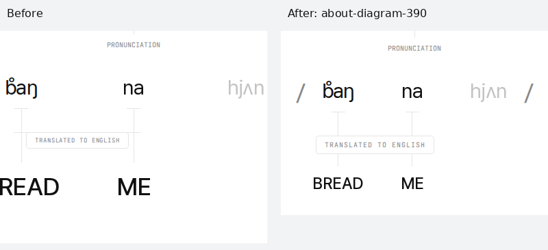

## 4. Career: 추천문 아래 출처 잘림

- 경로·폭·상태: `/career.html`, **390px**, 활성 추천인 카드 **부분 캡처**
- 재현: 추천인 카드로 이동하고 문장 끝부터 인물·직함·회사까지 읽습니다.
- As-is: 350px 고정 높이 때문에 카드 아래의 출처가 잘립니다.
- To-be: 내용에 맞춰 카드가 늘어나 인용문과 출처가 함께 보입니다.
- TC: **L03 / F07**. 6개 카드 × 320/390/767px의 인용문·출처 범위 검사가 통과했습니다. 오른쪽 주황 테두리는 검사 중 키보드 초점 표시이며 새 카드 색상이 아닙니다.

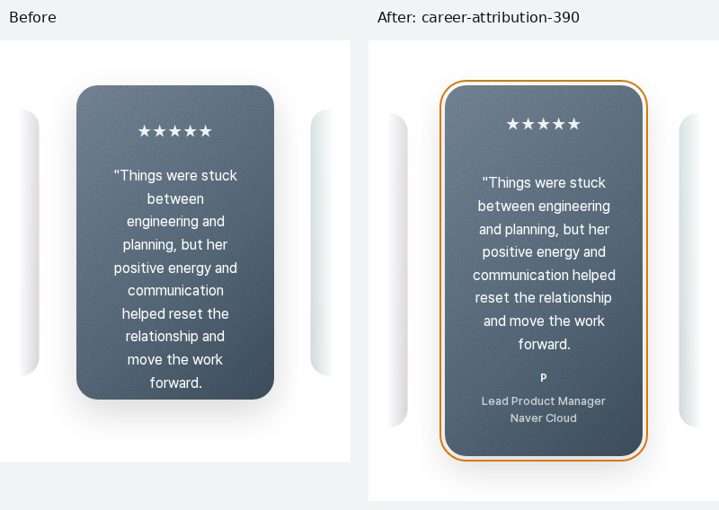

## 5. Articles: 세로로 늘어난 본문 이미지

- 경로·폭·상태: `/articles.html#article-detail?id=50044`, **390px**, 본문 중간
- 재현: 해당 글을 열고 인물 사진까지 내려갑니다.
- As-is: 폭만 줄고 원본 고정 높이가 남아 사진이 길게 늘어납니다.
- To-be: 모바일 높이를 자연 비율에 맞추고 데스크톱 높이는 기존 값을 유지합니다.
- TC: **R01–R18 / F12**. 이미지가 있는 17개 글의 47개 이미지 비율이 통과했습니다. 18개 글의 원문·이미지 URL·대체 텍스트는 유지합니다. 각 버전 본문의 계산된 중간 지점으로 스크롤하므로 세로 구도는 다릅니다.

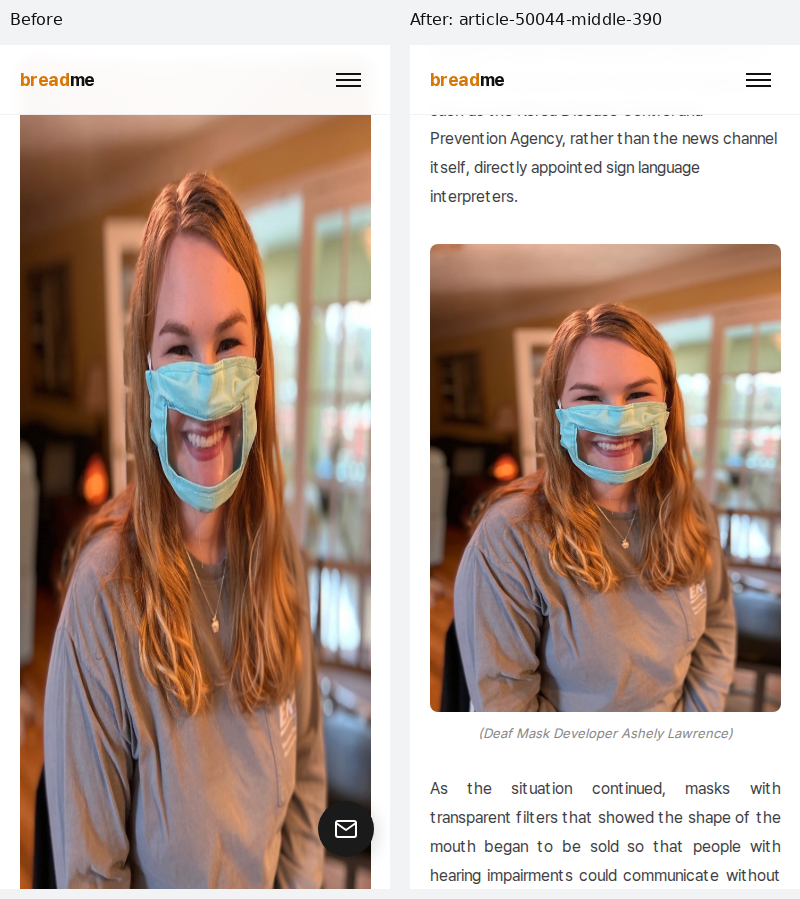

## 6. Projects: 펼친 항목의 화면 밖 링크

- 경로·폭·상태: `/projects.html`, **320px**, 첫 프로젝트 펼침
- 재현: Voice IVR 항목을 펼치고 부제와 Deep dive를 읽습니다.
- As-is: 부제와 동작 링크가 나란히 밀리면서 오른쪽이 화면 밖으로 나갑니다.
- To-be: 부제와 동작을 세로로 놓고 긴 제목이 줄바꿈되게 했습니다.
- TC: **L06 / I01** 및 `interactive-states.spec.ts`의 Projects 사례. 9개 펼침의 실제 텍스트 경계·닫기·중첩 목록 검사가 통과했습니다.
- 이 그림의 왼쪽은 첫 수정 후보 `19176d9`에서 추가 발견한 문제입니다. 오른쪽은 `44027e9`입니다. 스크롤 위치가 다르므로 펼친 문구와 링크를 비교하며, 헤더 변화의 증거로 사용하지 않습니다.

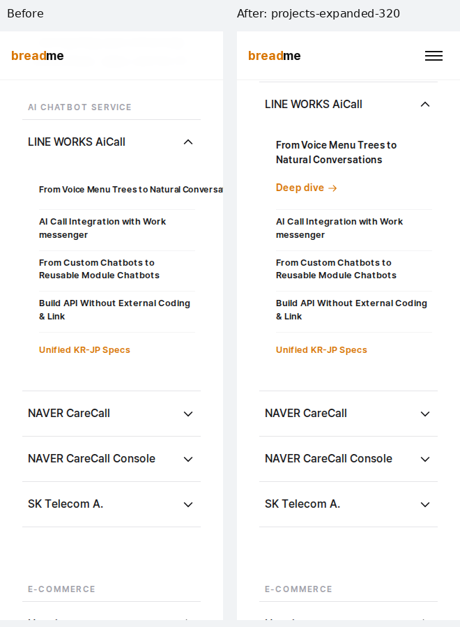

## 7. Contact: 200% 글자가 고정 상자 밖으로 잘림

- 경로·폭·상태: `/contact.html`, **320px**, 합성 글자 200%
- 재현: 본문 글자·줄간격을 실제 계산값의 2배로 만들고 첫 소개를 읽습니다.
- As-is: 350px 고정 상자가 제목 위와 설명 아래를 잘라 버립니다.
- To-be: 글자에 따라 소개 영역이 늘어납니다. 한 화면을 넘는 내용은 스크롤해서 이어 읽을 수 있습니다.
- TC: **L11 / F09**. 확대된 제목·본문이 컨테이너 안에 들어오는 범위 검사와 PNG 검수가 통과했습니다. 캡처 하단에서 다음 화면으로 이어지는 것과 상자 내부에서 잘리는 것을 구분합니다.

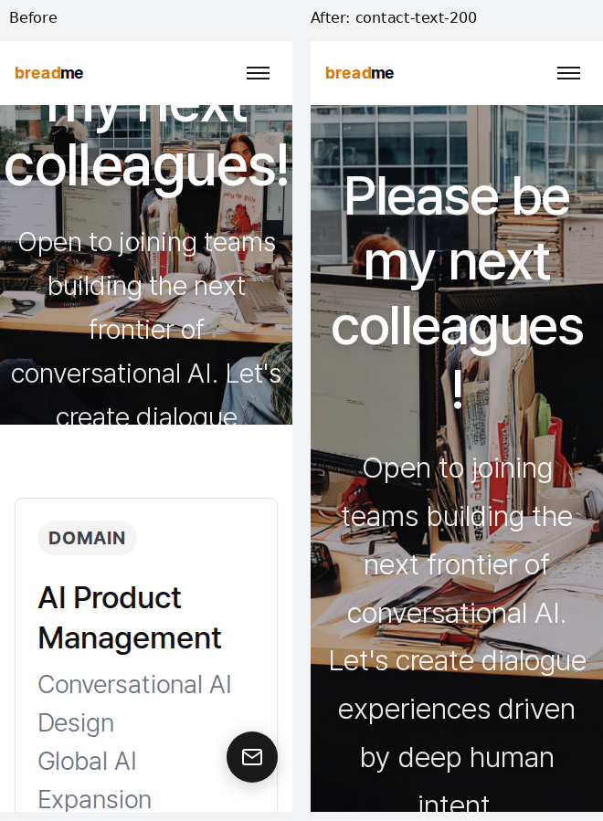

## 8. Enjoy: 확대된 소개와 사진 출처 겹침

- 경로·폭·상태: `/enjoy.html`, **320px**, 합성 글자 200%
- 재현: 같은 확대 상태에서 사진 위 소개와 사진 출처를 읽습니다.
- As-is: 절대 위치의 문구가 위로 사라지고 출처와 겹칩니다.
- To-be: 소개와 출처를 일반 문서 흐름에 놓아 글자 크기에 따라 영역이 늘어나게 했습니다.
- TC: **L05 / F10**. 확대된 제목·소개 문구 범위 검사와 PNG 검수가 통과했습니다. 사진·출처 문구는 유지합니다.

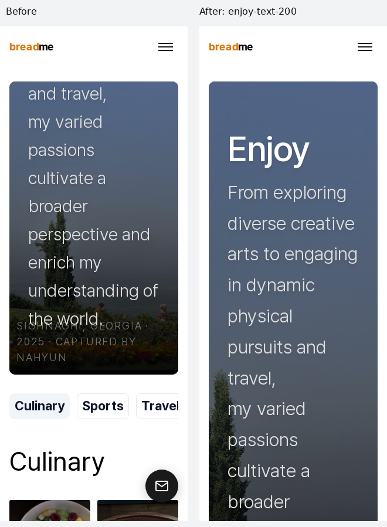

## 9. Voice IVR 메뉴: 지나치게 작은 메뉴 글자

- 경로·폭·상태: `/projects/llm-based-voice-ivr.html`, **320px**, 메뉴 열림
- 재현: 메뉴 버튼을 누르고 주 메뉴와 하위 메뉴를 읽습니다.
- As-is: 이 경로의 주 메뉴가 10.4px로 줄어들어 다른 페이지와 다릅니다.
- To-be: 공통 주 메뉴 16px·하위 메뉴 14px 기준으로 정리했습니다.
- TC: **M01 / F02**. 글자 크기·링크 접근·메뉴 닫기·초점 복귀 검사가 통과했습니다. 본문 임베드의 실행 오류 관찰은 아래 실행 기록에 별도로 남깁니다.

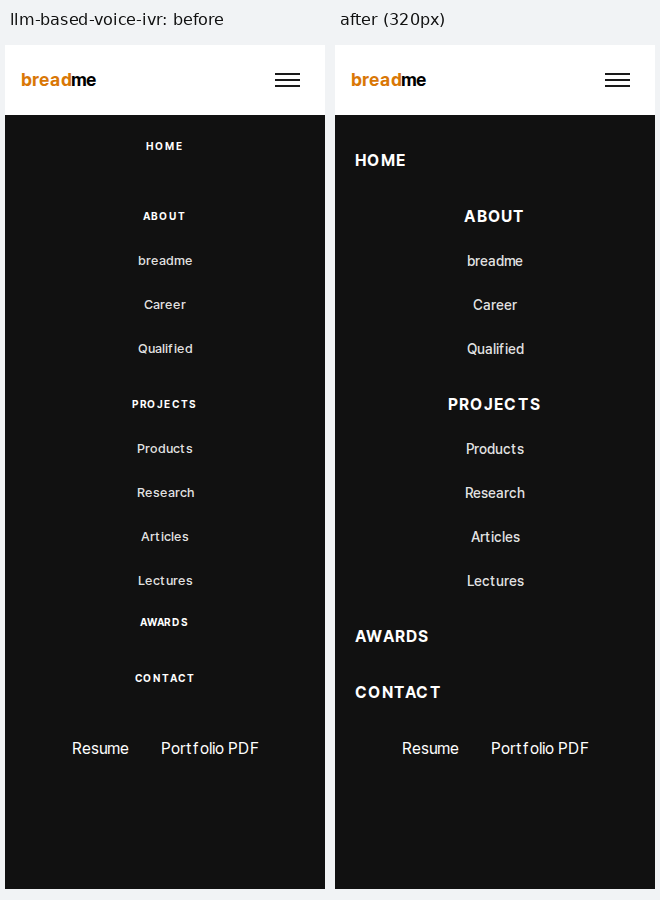

## 10. Projects 메뉴: 자료 바로가기의 링크 가림

- 경로·폭·상태: `/projects.html`, **320px**, 메뉴 열림
- 재현: 메뉴를 열고 아래 Resume/Portfolio PDF로 이동합니다.
- As-is: 떠 있는 원형 자료 버튼이 Portfolio PDF 글자와 겹칩니다. 본문에서도 같은 버튼이 문장 끝을 가리는 사례가 있었습니다.
- To-be: 767px 이하의 중복 원형 바로가기를 숨기고 메뉴의 자료 진입점을 유지합니다. 모든 모바일 페이지와 Home에 적용합니다.
- TC: **M01 / F03 / F13**. 메뉴로 Coming Soon 패널 열기·닫기·Escape·768→390 전환·보이는 메뉴 버튼으로 초점 복귀 검사가 통과했습니다. PDF 파일이나 자동 전송 기능은 추가하지 않았습니다.

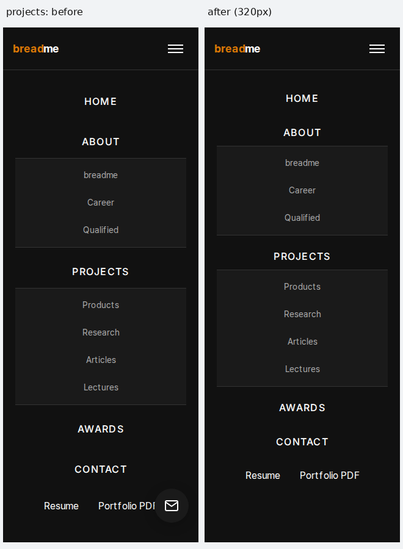

## 11. 공통 Footer: 작은 4열 링크와 조작 영역

- 경로·폭·상태: `/projects.html`, **390px**, 문서 끝/Footer
- 재현: 문서 끝까지 내려가 링크·언어·연락 아이콘을 읽고 누릅니다.
- As-is: 4열에 10px 링크와 11px 언어 버튼이 모여 있고 독립 조작 영역도 작습니다.
- To-be: 모바일 2열로 재배치하고 링크/언어 글자 14px, 독립 조작 영역 44px를 확보했습니다.
- TC: **F04**, 14개 경로의 공통 Footer 검사. 320/390/767px 텍스트 범위·글자 크기·조작 영역 크기 검사가 통과했습니다.
- 아래는 같은390px 축척입니다. 왼쪽은 Footer 주변 부분 캡처, 오른쪽은 문서 끝 전체 viewport입니다. 오른쪽 메뉴 버튼의 주황 테두리는 검사 중 키보드 초점입니다.

| As-is | To-be |
| --- | --- |
| 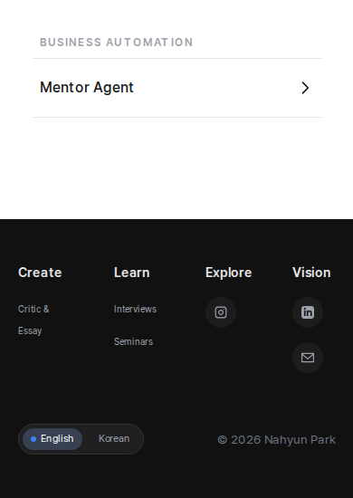 | 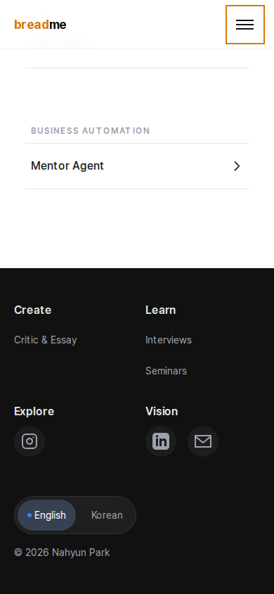 |

## 웹 화면 보존: 같은 디자인을 그대로 유지했는가?

불변 main `4f026a3`과 테스트 후보 `93af4a5`를 **같은 Chromium·글꼴·에셋·DPR1**에서 비교했습니다. 아래는 이 실행에서 **픽셀이 완전히 일치한 두 대표 사례**입니다. 전체 게이트 통과를 뜻하지 않습니다. [56개 비교의 전체 수치](mobile-ui-desktop-evidence.md)를 함께 보세요.

### D01. Awards, 1440px, 첫 화면

모바일에서 제목 배치를 바꿨지만 웹의 원래 그림·제목 배치는 유지됩니다. 아래 원본 PNG는 변경 픽셀 0개입니다.

| As-is: main `4f026a3` | To-be: 후보 `93af4a5` |
| --- | --- |
| 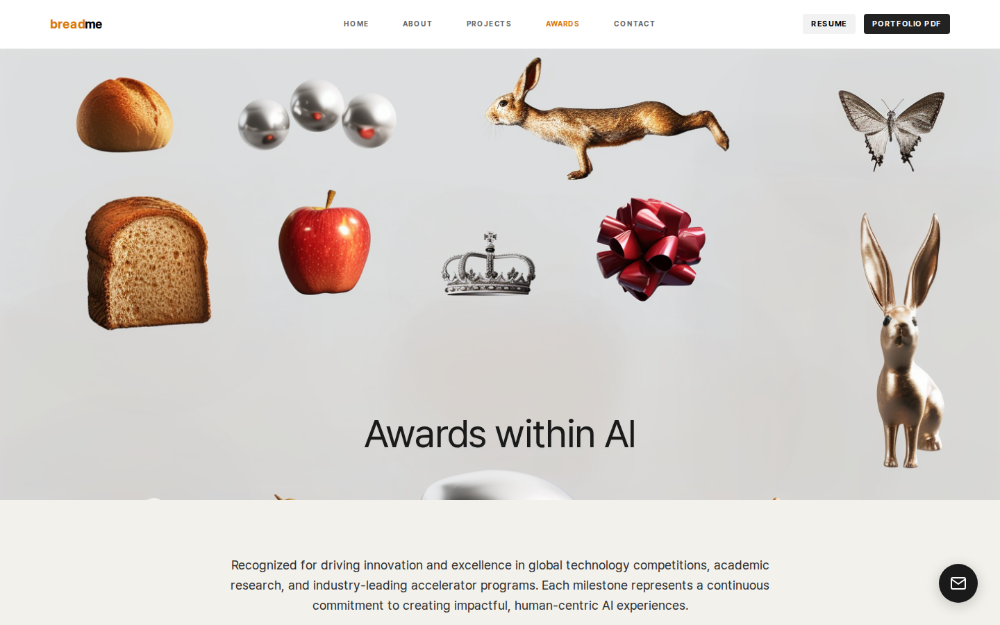 |  |

### D02. Projects, 1440px, Footer

모바일 Footer를2열로 바꿔도 웹의 기존 열·글자·간격은 유지됩니다. 아래 원본 PNG는 변경 픽셀 0개입니다.

| As-is: main `4f026a3` | To-be: 후보 `93af4a5` |
| --- | --- |
| 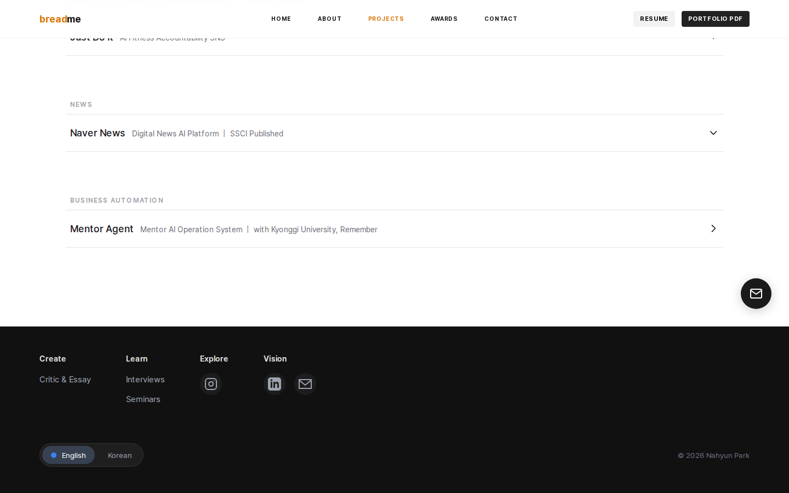 |  |

### 전체 웹 비교의 범위와 판정

- **14개 경로 × 768/1440px × 첫 화면/Footer = 56개 PNG 비교**입니다. 변경 픽셀 허용값은 0입니다.
- 동영상·iframe·canvas 등 동적 미디어 픽셀은 양쪽에서 똑같이 숨기고 그 영역의 위치·크기·스타일을 별도로 비교합니다.
- 모든 긴 페이지와 모든 상호작용 상태의 데스크톱 동일성을 증명하는 검사는 아닙니다.
- `44027e9`: 1440px의 28개 PNG는 모두 일치했습니다. 768px의 Enjoy/Voice IVR/AI Mentoring 첫 화면 3건은 경계 픽셀 차이로 엄격한 검사가 실패했습니다.
- `93af4a5`: 56개 중 53개 PNG가 일치했고, 기록된 기하 정보는 같았습니다. 5개 테스트 사례가 실패했습니다. 두 건은 추가 Inter 굵기의 로드 이력 차이이며 PNG 자체는 같았습니다. Enjoy 1440px와 Mentoring 1440px는 동일 빌드의 새 캡처에서 차이가 재현되어 렌더링 변동을 확인했습니다. Mentoring 768px는 이번 실행 안의 완전 동일 기준이 남아 있습니다.
- 최종 진단 `ac0644`: 25/28 사례, 53/56 PNG가 일치했습니다. Hopzie 768px 첫 화면 5픽셀, AI Mentoring 768px 첫 화면 2픽셀, Hopzie 1440px 첫 화면 13픽셀 차이가 남았습니다. 폰트 로드 목록은 진단 정보로 유지하며 실제 글꼴 준비·오류·픽셀 판정은 계속 검사합니다.
- 실패를 감추기 위해 픽셀 허용치를 올리거나 화면을 임의 수정하지 않았습니다. 앱 코드는 `44027e9` 이후 바뀌지 않았습니다.

## 실행 기록

| 커밋 | 검사 | 결과 | 증거 |
| --- | --- | --- | --- |
| `44027e9` | 모바일 전용 | **108/108 통과** | [Mobile UI 37269031674](https://github.com/nana-park/breadme/actions/runs/37269031674) |
| `44027e9` | 단위·기존 E2E | **94 / 79 통과** | [Foundation 37269031678](https://github.com/nana-park/breadme/actions/runs/37269031678) |
| `44027e9` | 정적 렌더·배포 경로 | **14 / 34 통과** | [Production paths 37269031679](https://github.com/nana-park/breadme/actions/runs/37269031679) |
| `44027e9` | 웹 픽셀 보호 | **25/28 사례 통과**, 위 3개 경계 사례 실패 | [동일 Mobile UI 실행](https://github.com/nana-park/breadme/actions/runs/37269031674) |
| `93af4a5` | 단위·기존 E2E / 정적·경로 | **94 / 79 / 14 / 34 통과** | [Foundation](https://github.com/nana-park/breadme/actions/runs/37270059789), [Production paths](https://github.com/nana-park/breadme/actions/runs/37270059816) |
| `93af4a5` | 모바일 전용 | **106/108 통과** | [Mobile UI 37270059784](https://github.com/nana-park/breadme/actions/runs/37270059784) |
| `93af4a5` | 웹 픽셀 보호 | **23/28 사례 통과**, PNG **53/56 일치** | [동일 Mobile UI 실행](https://github.com/nana-park/breadme/actions/runs/37270059784) |
| `ac0644` | 단위·기존 E2E / 정적·경로 | **94 / 79 / 14 / 34 통과** | [Foundation](https://github.com/nana-park/breadme/actions/runs/37272095124), [Production paths](https://github.com/nana-park/breadme/actions/runs/37272095316) |
| `ac0644` | 모바일 전용 | **107/108 통과** | [Mobile UI 37272095126](https://github.com/nana-park/breadme/actions/runs/37272095126) |
| `ac0644` | 변경 없는 main의 Voice IVR 진단 | **1/2 통과** | [동일 실행의 provider-baseline-evidence](https://github.com/nana-park/breadme/actions/runs/37272095126) |
| `ac0644` | 웹 픽셀 보호 | **25/28 사례 통과**, PNG **53/56 일치** | [동일 Mobile UI 실행](https://github.com/nana-park/breadme/actions/runs/37272095126) |

`93af4a5`의 모바일 실패 2개는 Voice IVR 320/390px 상호작용 중 관찰한 `this.api.isExternalMethodAvailable is not a function` 실행 오류입니다. 오류를 무시하는 필터는 추가하지 않았습니다. 후속 `ac0644`에서는 후보의 390px 사례와 변경하지 않은 main의 320px 사례에서 같은 오류가 관찰됐습니다. 동일한 두 폭을 각각 검사했지만 실패한 폭은 서로 다릅니다. 따라서 모바일 수정만으로 새로 생긴 오류라고 볼 근거는 없으며, 해당 실행 오류는 여전히 실패로 기록합니다. 변경 없는 main의 오류 stack은 YouTube의 `ytembeds` 스크립트에서 시작하는 것을 확인했습니다. 후보의 stack 원문은 아직 직접 확인하지 못했으므로 오류 문자열이 같다는 관찰과 구분합니다. 진단 단계는 실패해도 증거 수집을 계속하도록 설정되어 있으며, 그 단계 표시가 초록색이어도 테스트 2/2 통과를 뜻하지 않습니다.

이전 상호작용 JSON의 `status`는 마지막 실행 오류 assertion보다 먼저 기록된 중간 상태입니다. 합격 수치는 모든 hook을 포함한 Playwright 최종 로그를 기준으로 합니다. 후속 기록은 `statusBeforeRuntimeAssertion`과 `runtimePageErrorCheck`를 명시적으로 구분합니다.

기존 E2E 79개에 Home 5폭 검사가 포함됩니다. 별도의 Home 워크플로는 분기 조건으로 건너뛰었으므로 별도 실행 성공으로 세지 않습니다. 실제 본문·메뉴/초점·가로 이동·브라우저 역사·가까운 섹션 스냅·동작 줄이기는 각각 해당 TC와 기존 회귀 검사의 범위 안에서 확인했습니다.

## 남은 항목

1. **AI Mentoring의 선택적 제목/설명 크기 개선**: 기존 데모 데이터가 포함된 파일 업로드 제한으로 역할 표식 2개를 제외했습니다. 원본 JSX는 main과 동일합니다.
2. **실행 오류 관찰과 엄격한 웹 픽셀 판정**: 위 결과대로 남겨 둡니다. 재현 근거 없이 앱 결함 또는 외부 원인으로 확정하지 않습니다.
3. **브라우저 범위**: 실제 기기·Safari·스크린리더·브라우저 자체 200% 확대는 미검수입니다.
4. **기존 의존성 알림**: `npm ci`가 high 5개를 표시합니다. package.json/lock은 main과 동일하며 이번 작업에서 업그레이드하지 않았습니다. 세부 advisory 조회가 수행되지 않아 5개의 고유 취약점, 런타임 노출 또는 사이트 침해로 단정하지 않습니다.

## 다음 전체 검수에도 유지할 형식

모바일·웹의 **전체 디버깅 작업**에는 같은 작업 브랜치 안에 이 형식의 전후 비교 문서를 둡니다. 경로·폭·상태·문제·수정·TC·실제 결과·검수 한계를 함께 적고 README에서 바로 연결합니다. 개별 작은 수정마다 이 문서를 새로 만드는 것은 필수가 아닙니다.

이 문서의 이미지 파일은 CI artifact와 달리 저장소에 함께 보관됩니다. 테스트 로그 전체·사용자 브라우저 정보·인증 정보는 이미지 묶음에 포함하지 않습니다.
